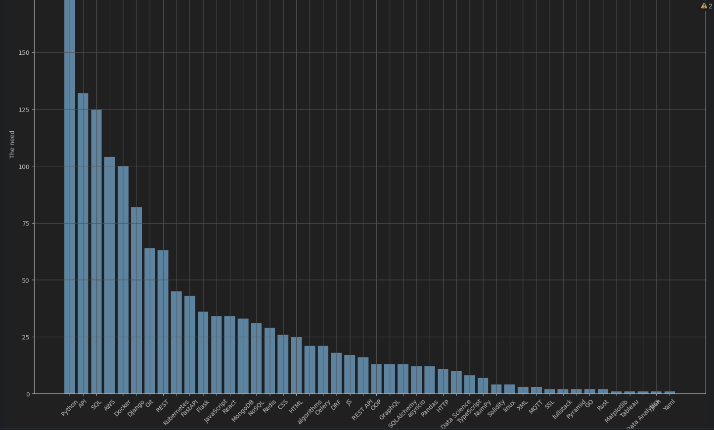
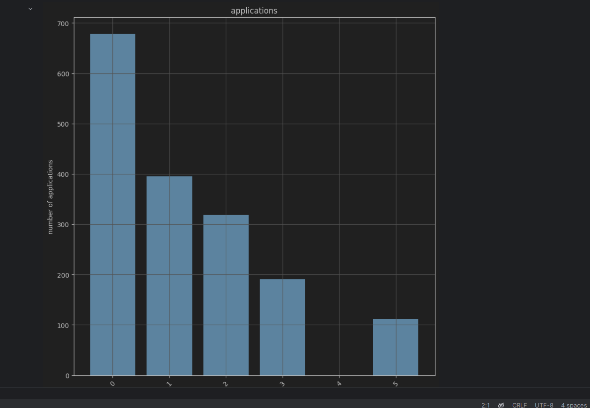

# DJINNI DATA ANALYSIS


- Python must have.
- activate venv:
```python
python -m venv venv
venv\Scripts\activate (on Windows)
source venv/bin/activate (on macOS)
```
- install all packages:
```python
pip install -r requirements.txt
```
Open `analysis.py` and run it ( Shift +F10 ).
## OR
Open `analysis.ipynb` and run all cell ( Ctrl+Alt+Shift+Enter )

## DEMO



